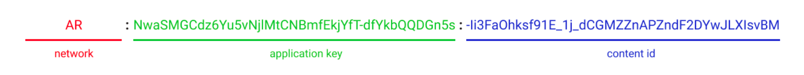

import Description from "@site/src/components/description";

# Registering Content


<Description
  text="Koii can be earned on any content where Proofs of Real Traffic are submitted."
/>

In order to mine new KOII tokens, each piece of content must be registered by paying a small fee in KOII. The fee can either be paid upfront, which costs less, or it can be paid after KOII has already been earned, in which case the fee will scale to the total earned.


**Registration Fees**

_Up Front -_ Small fee, fixed price, but must be paid in advance of any Proof of Real Traffic

_Lazy_ - Larger Fee, Scales to the total attention the content has received so far

:::info 

Need some KOII? Check [here](/develop/koii-software-toolkit-sdk/wallet-and-faucet) to airdrop some KOII into your wallet.

:::


**Content Types**

The network is designed to track content from any source and can be configured to credit app developers by specifying an application key. If no application key is specified, the registrar of the content ID receives all rewards. &#x20;



<Description
  text="Any piece of content can be registered for Attention Mining by constructing a URI like the one above, where the network key, application key, and content id contain valid data."
/>

**Supported Networks**

The K2 release will support a wide range of network prefixes, including ETH, AR, SOL, HTTP://, MATIC, and more. In general, token symbols can be used to specify layer one blockchains, and web URLs can be specified using the HTTP prefix.


**Note:** Currently only Arweave content formatted as Atomic NFTs is supported, but wider support for web URI, IPFS, EVM NFTs, and more will be released in early January 2023. [Contact us for early access.](https://koii.me/support)

## Recipients SDK Tool

We provide an SDK tool to help you easily register your content. Follow the steps to install and use it:

First, create a new Node.js project and install ```@_koii/k2-recipient-sdk```

```npm i @_koii/k2-recipient-sdk```

or

```yarn add @_koii/k2-recipient-sdk```

:::info

Notice: The node version should be 16.15.0 or higher. 

:::

Then please prepared a Koii wallet and some KOII in your wallet, which the attention reward will be collected.  Check about the [Koii CLI tool](/develop/koii-software-toolkit-sdk/using-the-cli) to quickly generate one and airdrop some KOII.

## Example

#### For Arweave NFT:

Put your Arweave wallet at the root first, then:

```jsx title="registerArweave.js"
const { registerArweaveNFT } = require("@_koii/k2-recipient-sdk") 
const  jsonfile = require("jsonfile");

async function main(){
    const wallet = jsonfile.readFileSync("ar-wallet.json");
    const recipientDataArweave = await registerArweaveNFT(wallet, {
        contentRegistryId:"<Your Arweave content transaction ID>", // Arweave transcation id
        k2PubKey: "<Your Koii Wallet public key>", // Koii wallet public key
    });  
    // example:
    // const recipientDataArweave = await registerArweaveNFT(wallet, {
    //     contentRegistryId:"05xEYtfjKwZ_tEIN5Yssg5-7HhQ_52Fwjs7JgCI0cOM", // Arweave transcation id
    //    k2PubKey: "4HV3retNdHCnNR4Q9KKdug2qQXTKvd8PJCehGJ6gTUKN", // Koii wallet public key
    // });   
} 

main()
```


#### For IPFS content:

Please provide a ```metadata.json``` file and put it at the root:

```jsx title="metadata.json"
{
  "name": "<Content-name>",
  "description": "<Content description >",
  "author": "<author>",
  "githubURL": "https://github.com",
  ...
}
```

Then provide a image as the thumbnail of your conntent.

Prepare your Koii Wallet and check example for the code:

```jsx title="registerIPFS.js"
const { registerIpfsNFT }  = require("@_koii/k2-recipient-sdk") 
// dotenv.config();
async function main() {
  //  IPFS recipient Signing
  //-----------------------------
  let recipientsDataIPFS = await registerIpfsNFT(
    {
      privateKey: new Uint8Array([
        16, 179, 201, 59, 157, 142, 252, 32, 11, 119, 232, 101, 245, 5, 225,
        ...
      ]), // Copy & Paste your Koii wallet json file content here
      image: "./scene-9.png", // Your content image here
      metadata: "./metadata.json", //Your metadata.json
    },
    "eyJhbGciOiJI..." // IPFS token
  );
}

main();
```