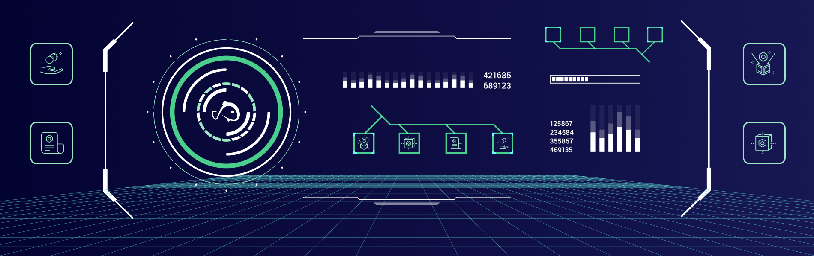

import Description from "@site/src/components/description";
import ContentLink from "@site/src/components/contentLink";

# 🛠 What is the Koii SDK?

<Description
  text="We're building one toolkit for all blockchains"
/>

As any industry matures, standardization and simplification become essential ingredients for promoting long-term growth. While many decentralized networks are still in their early stages, our mission at Koii is to empower developers by giving you as many options as possible when developing new applications.&#x20;

Supported Networks:

- Ethereum
- Arweave
- Filecoin (Coming Soon)
- Polygon (Coming Soon)
- Solana (Coming Soon)
- NEAR (Coming Soon)

 
We have developed a rich SDK in order to support the creation of Koii Tasks, Nodes, and Koii-X templates. This section includes key references and full API docs to support these initiatives.

### Web3 SDK

This is the KOII (K2) Javascript API built on the Koii. User can use this SDK to check status and fetch info from the K2 network.

Check more usage [here](./koii-javascript-api)

### Koii CLI

Koii CLI provides several features, including but not only:

- Generate Koii wallet
- Airdrop testnet KOII
- Run Koii test validator

Check the tutorial and try it [here](./using-the-cli)

### Create Task CLI

Create Task CLI helps you deploy your task to task node in less than 5min! [Prepare your task](../microservices-and-tasks/task-development-guide/) and try it [here](./create-task-cli)

### Task Node CLI

The task node CLI is a helpful tool used by node operators for 4 different reasons:

- Create a task staking wallet
- Create a distribution wallet
- Stake tokens on a task
- Show all tasks

Learn more and build complete your task [here](./what-is-the-koii-sdk)

### Looking for a quick start?

Head to our [Koii-X docs](../build-dapps-with-koii/welcome-to-koii-x/) to learn how you can deploy a dApp in under 10 minutes today.

<ContentLink title="👋 Welcome to koii-X" link="../build-dapps-with-koii/welcome-to-koii-x/"/>
