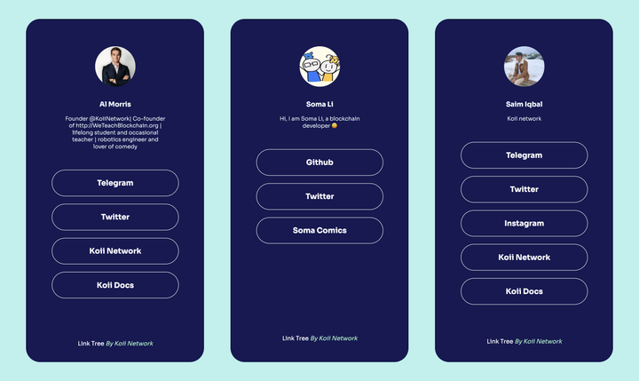

# Example Task: Linktree

This task is the second task in our series of explaining Koii tasks. The [Google Doodle task](/develop/microservices-and-tasks/google-doodle-task/) takes you through the process of turning a simple javascript program into a Koii task using the K2 Task Template. This tutorial will build on that and teach you how to use databases across many Koii nodes.

A LinkTree is a customized page that contains all the important links you want to share. The images below show a few examples of the Koii linktree. You can see the deployed version of the app <a href="https://linktree.koii.network" target="_blank">here</a>.

You can access the full project <a href="https://github.com/koii-network/linktree-app" target="_blank">here</a>

Once you have cloned the repo, open the terminal and run ‘yarn’ followed by ‘yarn start’

This will take you to the front-end page of the Koii linktree

You can use the public address of our developer Soma Li ‘0x07c3e160270ed08f307a49013f4b1ac37659e572’ to display his linktree as an example

The back-end code can be found in the ‘task-template-linktree’ folder

:::tip

If you encounter any difficulties, fell free to contact us at [Koii support](https://share.hsforms.com/1Nmy8p6zWSN2J2skJn5EcOQc20dg) or chat us at [Discord](https://discord.com/invite/koii).

:::

