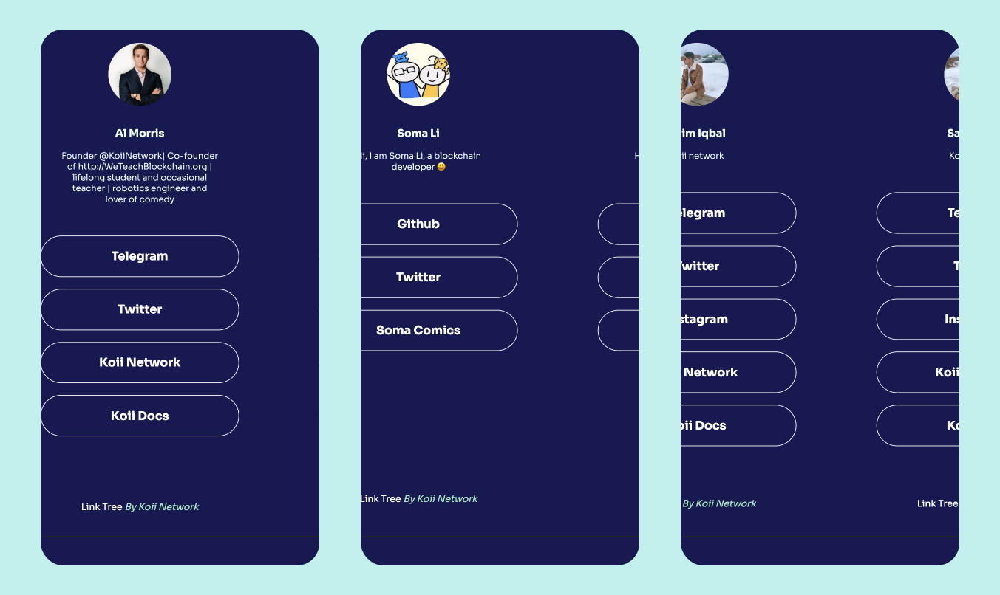

# Example Task: Linktree

This Koii task is the second task in our series of explaining Koii tasks. The [Google Doodle task](/develop/microservices-and-tasks/google-doodle-task/) takes you through the process of turning a simple JavaScript program into a Koii task using the [K2 Task Template](https://github.com/koii-network/task-template). This tutorial will build on that and teach you how to use databases across many Koii nodes.

A **LinkTree** is a customized profile page that contains all your important links. 

The images below show a few examples of the Koii linktree:



:::info

You can explore the deployed application [here](https://linktree.koii.network) and the [source code](https://github.com/koii-network/linktree-app).

:::

Once you have cloned the project, navigate to the task-template-linktree folder

```bash
cd task-template-linktree
```

Navigate to the test folder

```bash
cd test
```

You will find some pre-written tests here. You can go through the tests for all the files explained in this tutorial. Once you have a better understanding of the files discussed in this tutorial, feel free to edit these tests to familiarize yourself better with their implementation. You will need a strong understanding of these concepts for writing your Koii tasks.

:::info

The goal of this tutorial is to familiarize you with more advanced topics that will help you write your own Koii tasks.

:::

## What Will You Learn in This Tutorial?

This tutorial's goal is to familiarize you with more advanced concepts that are applied in the linktree task, such as database management and Api endpoints. Writing your own Koii tasks will be made easier for you if you have a good understanding of these features.

However, when it comes to more complex projects involving database management and the creation of API endpoints for user requests, several questions arise. let's talk about three crucial pieces of logic needed for this project to function properly:

| File                                                                                         | Description                                                                                                                                                                                                                                                                                                   |
| -------------------------------------------------------------------------------------------- | ------------------------------------------------------------------------------------------------------------------------------------------------------------------------------------------------------------------------------------------------------------------------------------------------------------- |
| [db_model.js](https://github.com/somali0128/task-template-linktree/blob/main/db_model.js)    | A **local database** is required to store and manage data such as Linktree information, proofs, and the authentication list on a [node](/develop/microservices-and-tasks/run-a-task-node) operator's local device. This is important because it reduces the need for frequent API calls to a remote database. |
| [routes.js](https://github.com/somali0128/task-template-linktree/blob/main/routes.js)        | **API endpoints** will be required for the project to handle incoming requests, process data, and return appropriate responses to the client.                                                                                                                                                                 |
| [db_sharing.js](https://github.com/somali0128/task-template-linktree/blob/main/dbSharing.js) | Since each Koii node has its own local database, when one node’s data is updated, it must also be updated on other nodes to ensure consistency. The `db_sharing.js` will contain a single function called `share()` that works to keep the network synchronized.                                              |


:::tip

If you encounter any difficulties, fell free to contact us at [Koii support](https://share.hsforms.com/1Nmy8p6zWSN2J2skJn5EcOQc20dg) or chat us at [Discord](https://discord.com/invite/koii).

:::


