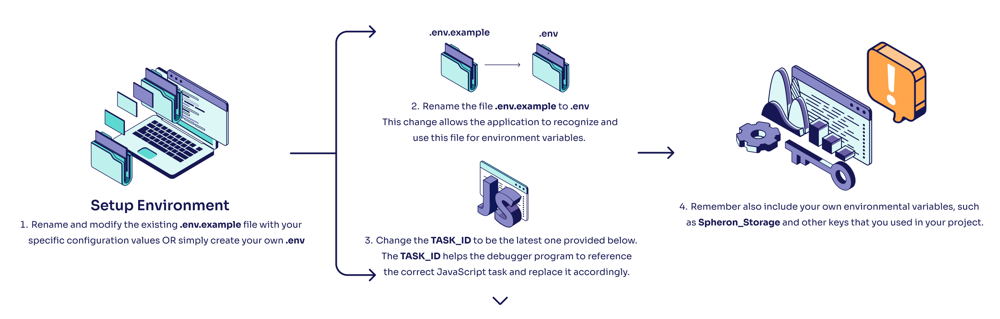

# **Testing Your Task with Easy Testing**

Congratulations on completing the basic Jest tests and unit tests! This shows that your task is functioning correctly. Next, you will learn how to use our custom-designed **Easy Testing v0.1** to simulate how your task operates on other users' Koii Nodes.

## **Process Overview**

Here's a step-by-step guide to using Easy Testing:

### Step 1: Set up .env (optional)



```sh
TASK_ID = "AK2P1L8NWGwWarbHeM7tX2mr4hJA7ZVXGSSSz5PWHBHv";
```

Here's an example of using task extension variables in the your `.env`:

```sh
TASK_ID = "AK2P1L8NWGwWarbHeM7tX2mr4hJA7ZVXGSSSz5PWHBHv";
TWITTER_USERNAME = "testuser123";
```

:::danger
To deploy your task, please use yarn webpack again to avoid leaking your environmental variables.
:::

### **Step 2: Modify Your Code**


```sh
...
console.log('ROUND', round);
const value = 'Hello, World!';
console.log("TEST", value); // <--- Add this here!
if (value) {
  await namespaceWrapper.storeSet('value', value);
}
...
```

This setup enables our program to capture logs related to testing and provide you with feedback during the execution.

### **Step 3: Monitor and Push Updates**


```sh
npm run prod-debug
```

This command facilitates continuous monitoring and updating, ensuring that any changes you make are immediately reflected and tested.

### **Step 4: Run the Testing Task**

## 

Now, you should be able to observe the output in your task.

## Build Your Own Testing Task

The easy testing task we provided does not include audit and distribution functions and features a very short round time. Therefore, if you wish to test longer tasks and explore the distribution and audit functionalities, you are encouraged to create your own task. Creating your own task allows you to directly have access to the associated `config-task.yml` which holds information on round times, bounties, and stakes. For security reasons, you aren't able to customize those aspects of the easy testing task but you're able to do so with your own task!

## Filtering Logs w/ Keywords

You’ve now successfully debugged the Easy Testing task in real time directly on Koii Node! Next, you’ll see you can easily filter logs with specific keywords!


### **Step 1: Navigate to debugger.js**

To configure specific keyword filters for live debugging, first find debugger.js, which contains the following code:

```js
class Debugger {
  static taskID =
    process.env.TASK_ID || "3sFhZoxfze7RQJqMGSR3L3gtg8AeiYZ6D42QwFc3nuEV";
  static webpackedFilePath = process.env.WEBPACKED_FILE_PATH || "dist/main.js";
  static keywords = process.env.TEST_KEYWORDS || ["TEST"];
  static nodeDir = process.env.NODE_DIR || "";
}
```

### Step 2: Configure specific keywords

Debugger.js contains all the different variables required to facilitate the live debugging process possible! As you can see in the list of keywords to filter by, the default is ‘TEST’. You modify and add as many filters as you choose to, with an example shown below:

```js
  static keywords = ['TEST', 'ERROR', 'WARNING'];
```

As simple as that, you’re now successfully able to filter your logs by a number of keywords in real time!
