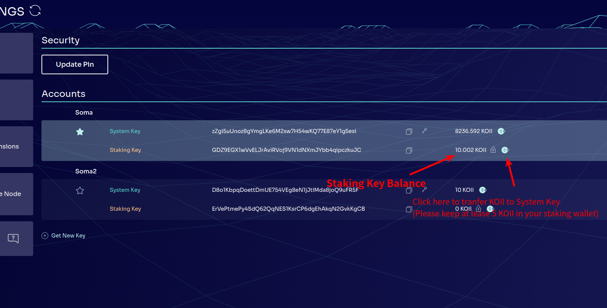

## Q: I accidently deleted my Spheron storage key, how to get another one?

1. **Setting up a new account** and generating a new key will be the **easiest** way, then you can switch back to using your newly generated key for your previous account.

2. Also, you can easily **transfer** your KOII tokens from your Koii node application to your Finnie wallet. And **then transfer them to your new account** and keep mining.

3. Additionally, they can **follow this tutorial**: [Click Here](https://docs.spheron.network/rest-api/#creating-an-access-token) to get a new one and manually insert it.

## Q: My task failed at: Start task/Upgrade task/accidentally close the Koii Node and lead to stake token gone. Where should I find them?

If you believe that your KOII is lost, it would be a good idea to check your staking balance first. If your KOII is there you can follow the instructions on the image to send those KOII back to your main wallet.


## Q: Why don’t I have permission to check the main.log when an error occurred in my task? How to fix it?

It should be the **permission** issue, try running it as **Administrator** and try again.

## Q: I have an issue with my KOII stuck in the stake box, they can neither take it back nor use them to run the task. What should I do?

We noted this issue(**token stuck in the box**), Will patch this in the next version.

Somehow your task ended in the available tasks, but you still have some KOII staked. **Your KOII are safe and staked in the task**. Its just a UI issue that when you trying to click play button it is trying to stake KOII again and since you doesn't had that much KOII so you is not able to stake it again.

## Q: I am trying to run twitter tasks for a while now but keeps facing this issue "Password is incorrect or email verification needed".

Please open an **incognito** window, go to twitter login page and use your username(not email or phone number), and password to log in to Twitter. You might face a reCAPTCHA from Twitter. After any verification such as email or phone number and you can log in without the verification, use Koii Node and try to run the task again.

## Q: What should I do if I facing  an RPC request error shows like this?
```
Error: RPC request error: cluster version query failed: error sending request for url (https://k2-testnet.koii.live/): error trying to connect: tcp connect error: A connection attempt failed because the connected party did not properly respond after a period of time, or established connection failed because connected host has failed to respond. (os error 10060)
```

**Solution:** please type in this:  
```koii config set -- url https://testnet.koii.live```

## Q: What should I do if I meet this Javascript error?


**For Mac**: Delete this file and start the node ~/Library/Application Support/desktop-node/config.json 

**For Linux/Windows**: Delete this file and start the node ~/.config/desktop-node/config.json

**For Windows**: Delete this file and start the node %APPDATA%/desktop-node/config.json

<!--Keep this section in the very last please-->

## Warning 
1. Please **do NOT** delete the Spheron key as it is not recoverable.

2. Please double check if your **Twitter information** is correct. (i.e. setting Spheron key for twitter username, password, and phone) 


