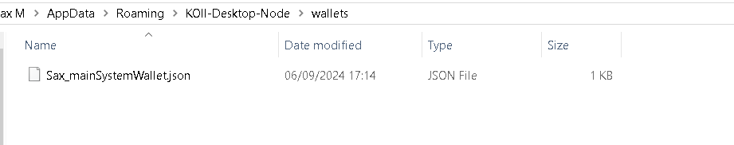

import ReactPlayer from "react-player";

## Tutorial: How to Re-onboarding

**Road map for how to Re-Onboarding**

- save the old passphrase (Settings-->Security-->key icon)
- save the old storage key (Settings-->Task Extensions-->eye icon)
- import your old account to Finnie wallet (skip if you are already done)
- find the Koii-Desktop-Node, desktop-node folder and delete it

**For Windows**: Go to File Explorer, type in `%appdata%/KOII-DESKTOP-Node`

**For Linux**: Open the terminal, type in `cd /home/<user_name>/.config/KOII-DESKTOP-Node`

**For Mac**: Go to Finder, click `command+shift+G`, type in `/Users/<user_name>/Library/Application Support/`

- download the Koii node [here](https://www.koii.network/nodes)
- create a new account
- remember the new passphrase (12-secret-phrase)
- **skip** the faucet
- transfer some KOII to your new account
- click confirm to onboarding, and wait until it completed
- enter the storage key
- run the other tasks

<ReactPlayer width="100%" controls url="https://youtu.be/YvtPFUIQQFk" />

## Tutorial: How to Transfer funds between System and Staking

<ReactPlayer width="100%" controls url="https://youtu.be/SXjC5LMlV_s" />

## Tutorial: How to Access Your Secret Phrase

<ReactPlayer width="100%" controls url="https://www.youtube.com/watch?v=HtmQH0d7Gwo" />

## Tutorial: Finnie Wallet

**Setting Up Finnie Wallet**

Register Finnie Wallet:

1. Add Finnie as a browser extension from [HERE](https://chromewebstore.google.com/detail/finnie/cjmkndjhnagcfbpiemnkdpomccnjblmj).
2. Click “**Get a new key**” and follow the instructions to create a new wallet.
3. Set up your password by selecting “**Start from scratch**,” then “**Koii**.”
4. Carefully note down the **12-word secret phrase** provided, as it is critical for your account recovery and security.

**Here is the tutorial video**:

<ReactPlayer width="100%" controls url="https://www.youtube.com/watch?v=Hj2xf5xWdqQ" />

**Importing Wallet to Koii Node**

Install Koii Node:

- Download the latest version of the Koii Node software from [HERE](https://www.KOII.network/nodes).
- Launch Koii Node, and if it's your first time, follow the initial setup prompts.
  Prepare Wallet Details:
- Have your 12-word secret phrase from Finnie wallet ready for the import process.
  Import Wallet:
- In the Koii Node software, find and select “**Import with seed phrase**.”
- Enter your Finnie wallet 12-word secret phrase when prompted.

**Managing and Transferring Tokens**

Transfer Tokens:

- With your wallet imported, you can manage and transfer tokens using Koii Node.

To **sell** or **transfer** tokens:

- Go to **settings** in the top right corner, select “**Security**” on the left.
- Next to your token balance, click the button to open the transfer interface.
- Input your destination wallet address, which you can find by clicking “**Receive**” in your Finnie wallet and copying the address.
- Specify the number of tokens you wish to transfer.

**Here is the tutorial video**:

<ReactPlayer width="100%" controls url="https://www.youtube.com/watch?v=usT3OdGJ6iE" />

Always ensure the security of your secret phrase and double-check all details before confirming transactions.

## Tutorial: Twitter Task Configuration

<ReactPlayer width="100%" controls url="https://www.youtube.com/watch?v=t9D4w9bKD1g" />

## Tutorial: Step-by-Step Guide to turn off the twitter notifications for the tasks

1. Open your browser.

2. Login your email webpage in this tutorial, using Gmail for example.

3. Click block "X"

## Tutorial: Step-by-Step Guide to migrate a node account to a new address and initialize it

This tutorial will include steps:
- Create a new Node Account/Wallet
- set it up properly
- migrate all your tokens on the new account with a new seedphrase.
- keeping a backup of this actual account.

## STEP 0 - Stop, unstake and archive
First stop all your tasks.
Wait until you are able to Unstake and Archive from 3 vertical dots (on each task).

## STEP 1 – Backup your wallet
Go to "Settings" press "Get Node Logs" and you'll end up in the folders.
Once in the folder please go up 1 level in the folder hierarchy.
You'll notice a folder named "Wallets"

Inside the “Wallets” folder you’ll find a file similar to mine here:

Backup this file, is the only way to access this "old" account from now on.
Make a copy on cloud storage or USB Device if you like
Now we can just wait for the last task to cool down, here is the procedure to follow after:
## Step 2 – Create a new Wallet/Account on your Node
Create a new wallet address.
Make sure you securely store the 12-word passphrase.
(Paper-screenshots).
Step by Step:
Claim all rewards.
Create a New Account
(Koii Node Settings -> Wallet -> Add New Account)
(located at the bottom of the page)
Click "Get a New Key".
Follow the procedure to get a new one.

After you have done, first send 30 $ Koii, 5 $OFire and 5 $OBird from your **OLD** System Key 
to the **NEW** System Key.
## Step 3 – Set Up your New Account
Activate your new account using the "star" icon on the right of your new account's name.

After the **NEW** account is active please go to "Add Task"
Add in order:
Inflation Monitoring and wait for confirmation.
Free Fire Token and wait for confirmation.
After your tasks are running in My Node, go to Wallet.
Send 10 $Koii from your **NEW System Key** to the **NEW Staking Key**.
Make Sure that your new **KPL Staking key** has been set with about 0.079 $Koii.
Send 3 $Koii from your **New System Key** to your **New KPL Staking Key**
Add as many tasks as you want and migrate all the other tokens from the old account to the new 
one.
### To migrate your tokens don't forget to leave at least 2 $Koii on your **OLD SYSTEM KEY** 
to pay for the blockchain's fees of your tokens' transactions.
