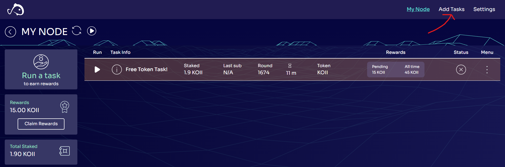
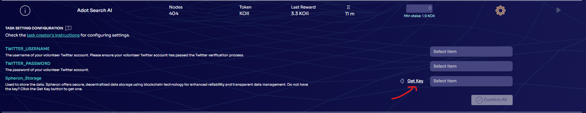

import ReactPlayer from "react-player";

## Tutorial for Re-onboarding

**Road map for how to Re-Onboarding**

- save the old passphrase (Settings-->Security-->key icon)
- save the old storage key (Settings-->Task Extensions-->eye icon) 
- import your old account to Finnie wallet (skip if you are already done)
- find the Koii-Desktop-Node, desktop-node folder and delete it

**For Windows**: Go to File Explorer, type in `%appdata%/KOII-DESKTOP-Node`

**For Linux**: Open the terminal, type in `cd /home/<user_name>/.config/KOII-DESKTOP-Node`

**For Mac**: Go to Finder, click `command+shift+G`, type in `/Users/<user_name>/Library/Application Support/`

- download the Koii node [here](https://www.koii.network/node)
- create a new account
- remember the new passphrase (12-secret-phrase)
- **skip** the faucet
- transfer some KOII to your new account
- click confirm to onboarding, and wait until it completed
- enter the storage key
- run the other tasks

<ReactPlayer width="100%" controls url="https://youtu.be/YvtPFUIQQFk" />

## Tutorial for Finnie Wallet

**Setting Up Finnie Wallet**

Register Finnie Wallet:

1. Add Finnie as a browser extension from [HERE](https://chromewebstore.google.com/detail/finnie/cjmkndjhnagcfbpiemnkdpomccnjblmj).
2. Click “**Get a new key**” and follow the instructions to create a new wallet.
3. Set up your password by selecting “**Start from scratch**,” then “**Koii**.”
4. Carefully note down the **12-word secret phrase** provided, as it is critical for your account recovery and security.

**Here is the tutorial video**:

<ReactPlayer width="100%" controls url="https://www.youtube.com/watch?v=Hj2xf5xWdqQ" />

**Importing Wallet to Koii Node**

Install Koii Node:

- Download the latest version of the Koii Node software from [HERE](https://www.KOII.network/node).
- Launch Koii Node, and if it's your first time, follow the initial setup prompts.
  Prepare Wallet Details:
- Have your 12-word secret phrase from Finnie wallet ready for the import process.
  Import Wallet:
- In the Koii Node software, find and select “**Import with seed phrase**.”
- Enter your Finnie wallet 12-word secret phrase when prompted.

**Managing and Transferring Tokens**

Transfer Tokens:

- With your wallet imported, you can manage and transfer tokens using Koii Node.

To **sell** or **transfer** tokens:

- Go to **settings** in the top right corner, select “**Security**” on the left.
- Next to your token balance, click the button to open the transfer interface.
- Input your destination wallet address, which you can find by clicking “**Receive**” in your Finnie wallet and copying the address.
- Specify the number of tokens you wish to transfer.

**Here is the tutorial video**:

<ReactPlayer width="100%" controls url="https://www.youtube.com/watch?v=usT3OdGJ6iE" />

Always ensure the security of your secret phrase and double-check all details before confirming transactions.

## Tutorial: Step-by-Step Guide to Getting a Spheron Storage Key

**Step 1: Logging in**

1. Visit the Koii Node platform. If you don’t have it, you can download it at [HERE](https://www.koii.network/node).

2. Enter your six-digit credentials to log in. If you don’t have an account, you’ll need to create one.

**Step 2: Navigating to Storage Key Section**

1. Once logged in, navigate to the **Add Task** dashboard.

**Step 3: Generating a Storage Key**

1. Select the option to create a new storage key (click the **gear wheel**).

2. Click **Get Key** to automatically get the Spheron_Storage key.

3. Follow the on-screen instructions. Select **Spheron_Storage**.

## Tutorial: Using the Storage Key in the Task Node

**Step 1: Accessing the Task Node**

Click the **gear wheel** beside the task that you want to run.

**Step 2: Entering the Storage Key**

Select the Spheron_Storage you created.

**Step 3: Stake the tokens**

Stake the tokens (we call them KOII) to the program you want to run.

**Step 4: Run the task**

1. Click the triangular symbol to run the task!

## Tutorial: Step-by-Step Guide to turn off the twitter notifications for the tasks

1. Open your browser.

2. Login your email webpage in this tutoriual, using Gmail for example.

3. Click block "X"

