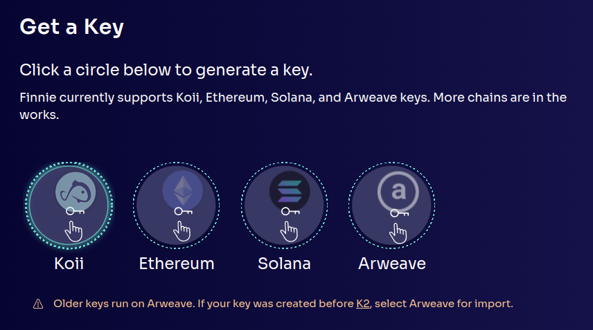
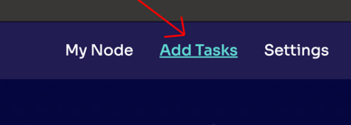
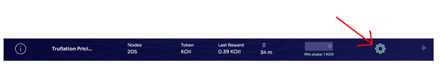
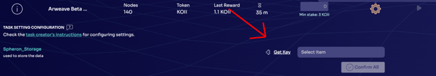
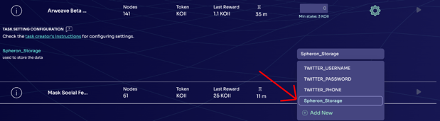
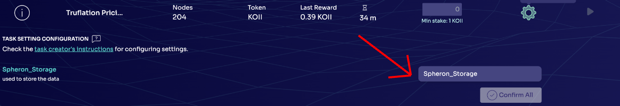
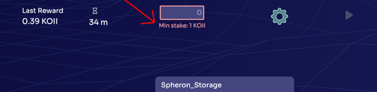
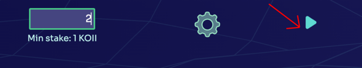

Questions? We have answers. If you can't find what you're looking for, please contact us on [Discord](https://discord.gg/koii).

## Q: How to download/update Koii Node?

Please visit [Koii Node](https://www.koii.network/node) and click "Download Now" to download the latest version of Koii Node. Koii Node will auto update when a new version is available. For Linux users, please download the latest version and replace the old one. If you have trouble updating, please contact us on [Discord](https://discord.gg/koii).

## Q: How to create a Koii account?

After downloading Koii Node, please follow the instructions to create a Koii account. You will need to provide a account name and a password. System will provide you with a **private key**. Please keep your private key safe. You will need it to log in to your account if you switch your device. If you lose your private key, you will lose access to your account.

## Q: How to get some KOII tokens?

You can get KOII tokens by visiting our **faucet page** or **running the tasks**. After log in to Koii Node, please click "Add funds" button at the bottom left corner. You will be directed to our faucet page. Please follow the instructions to get some KOII tokens.

## Q: How to run the task?

After log in to Koii Node, you will see the avaliable task list. Stake some KOII tokens to the task you want to run. After staking, please click "Run" button to run the task. Some tasks need to set up the task enviorment to run, Please follow the instructions to complete the item set up.

Notice: You can run multiple tasks at the same time. Please make sure you have enough KOII tokens to stake.

## Q: How to check the task status?

The tasks status are listed in My Node page. If the task is shown as "Error" and stop running, please check the task log to see what's wrong. If you have trouble fixing the error, please contact us on [Discord](https://discord.gg/koii).

## Q: How to withdraw KOII tokens?

After running the task, you will earn your first reward after 10 - 30 minutes. Then you can withdraw your KOII tokens **by clicking "Claim Rewards" button**. The longer you run the task, the more KOII tokens you will earn. **You can withdraw your KOII tokens at any time**.

## Q: I accidentally clicked on the devnet. how can I open again my koii app/node?

**For Mac**: Delete this file and start the node ~/Library/Application Support/desktop-node/config.json

**For Linux**: Delete this file and start the node ~/.config/desktop-node/config.json

## Q: My task failed at: Start task/Upgrade task/accidentally close the Koii Node and lead to stake token gone, Where should I find them? 

Mostly can find out in your staking wallet. And then you can find back their lost tokens.

## Q: what's the suggest balance I should at lease have in staking wallket?

It varies on the amount of data you will hold, so if you are running more task you will be storing more data in staking wallet. 

**Around 7 KOII** is sufficient for 1mb of rent exemption, though if you have more data and less koii than rent exemption you will need to pay rent ~0.0047 KOII per epoch per mb.

## Q: Why I doesn't have permission to check the main.log when a error occurred in my task? How to fix it?

It should be the permission issue, try run it as **Administrator** and try again

## Q: I have an issue of stuck my koiis in the stake box, they can neither take it back nor use them to run the task, What should I do?

We noted this issue(**token stucked in the box**), Will patch this in the next version. 

Somehow your task ended in the Available tasks but you still has some koii staked. Your koii are safe and staked in the task. Its just a UI issue that when you trying to click play button it is trying to stake  KOIIs again and since you doesn't had that much KOII so you is not able to stake it again.

## Q: I created wallet when koii were on K1 (Arweave based koii) but as koii have migrated to k2 (Solana forked KOII), what should i do to get my tokens back.

You **cannot keep use your old key phrase to retrieve the wallet**, Older keys run on Arweave. If your key was created before K2, select Arweave for import.

## Q:  Lost a lot of tokens overnight (not in my staking key).

The problem is you may **stake too many koii** on a single task, and might have get slashed, most tasks currently are not really dependent on the stake amount currently, so staking more won't get you more KOII for these tasks (In future there will be such tasks). 

For safety you can also have another cold wallet that you don't use with the koii node, and then you can **transfer all the amount that is not in use to that cold wallet and only use the node wallet as hot wallet for all the tasks running and staking**

## Q: I have issue with unable to claim rewards or unstake my Koiis 

The issue is **you doesn’t have enough koii to pay for the transaction fees** of unstake and claim rewards.
Please **not to empty your main wallet completely**, just put some koii so that it can cover for transaction fees like submitting data for task, claiming reward, unstaking etc

## Q: I am trying to run twitter tasks for a while now but keeps facing this issue "Password is incorrect or email verfication needed".

please open an **incognito** window, go to twitter login page and use your username(not email or phone number), and password to log in to twitter. You might faced a reCAPTCHA from twitter. After any verification such as email or phone number and you can log in without the verfication, use Koii Node and try to run the task again.

## Tutorial for Finnie Wallet

**Setting Up Finnie Wallet**

Register Finnie Wallet:  
1. Add Finnie as a browser extension from [HERE](https://chromewebstore.google.com/detail/finnie/cjmkndjhnagcfbpiemnkdpomccnjblmj).
2. Click “**Get a new key**” and follow the instructions to create a new wallet.
3. Set up your password by selecting “**Start from scratch**,” then “**Koii**.”
4. Carefully note down the **12-word secret phrase** provided, as it is critical for your account recovery and security.

**Here is the tutorial video**: [Register Finnie Wallet](https://www.loom.com/share/8e0900d0f3414aabbcc2eb392b773e40?sid=44b74f75-9373-4a42-b374-f335513771fa).

**Importing Wallet to Koii Node**

Install Koii Node:  
- Download the latest version of the Koii Node software from [HERE](https://www.koii.network/node).
- Launch Koii Node, and if it's your first time, follow the initial setup prompts.
Prepare Wallet Details:  
- Have your 12-word secret phrase from Finnie wallet ready for the import process.
Import Wallet:  
- In the Koii Node software, find and select “**Import with seed phrase**.”
- Enter your Finnie wallet 12-word secret phrase when prompted.

**Managing and Transferring Tokens**

Transfer Tokens:  
- With your wallet imported, you can manage and transfer tokens using Koii Node.

To **sell** or **transfer** tokens:  
- Go to **settings** in the top right corner, select “**Security**” on the left.
- Next to your token balance, click the button to open the transfer interface.
- Input your destination wallet address, which you can find by clicking “**Receive**” in your Finnie wallet and copying the address.
- Specify the amount of tokens you wish to transfer.

**Here is the tutorial video**: [Transfer Token](https://www.loom.com/share/d2b6a875fc444f61b2167834595724a0?sid=058bc2db-a269-47c6-82c0-5c328064194b)

Always ensure the security of your secret phrase and double-check all details before confirming transactions.

## Tutorial: Step-by-Step Guide to Getting a Spheron Storage Key
**Step 1: Logging in**

1. Visit the Koii Node platform.If you don’t have it, you can download it at [HERE](https://www.koii.network/node).

2. Enter your six-digit credentials to log in. If you don’t have an account, you’ll need to create one.

**Step 2: Navigating to Storage Key Section**

1. Once logged in, navigate to the **Add Task** dashboard.

**Step 3: Generating a Storage Key**

1. Select the option to create a new storage key (click the **gear wheel**).

2. Click **Get Key** to automatically get the Spheron_Storage key.

3. Follow the on-screen instructions. Select **Spheron_Storage**.

## Tutorial: Using the Storage Key in the Task Node
**Step 1: Accessing the Task Node**

Click the **gear wheel** beside the task that you want to run.

**Step 2: Entering the Storage Key**

Select the Spheron_Storage you created.

**Step 3: Stake the tokens**

Stake the tokens (we call them KOII) to the program you want to run.

**Step 4: Run the task**

1. Click the triangular symbol to run the task!

