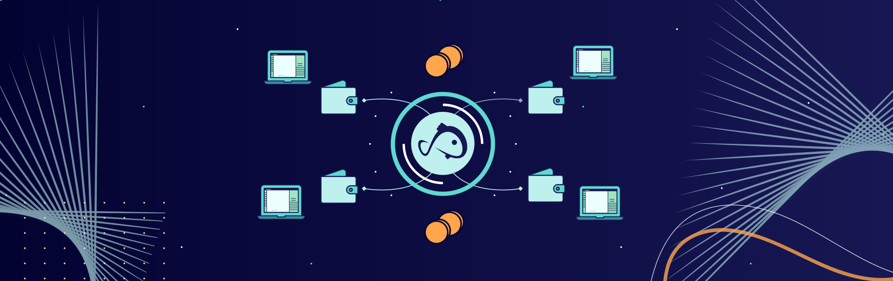

import Tooltip from "@site/src/components/tooltip";

## Value through practical demand

**KOII** tokens are always inherently valuable as they can always be converted into computing power.

They are the default currency of the Koii Network, which is a global network of computers that rivals traditional hosting solutions like AWS.

Because of the principle of supply and demand, as long as our network offers a better price-performance ratio than traditional hosting solutions, there will always be a demand for KOII tokens.

And due to its nature, as we don't have any middlemen (you directly pay your hosters, which are ) that aim to make a profit, we can **always** offer a better price-performance ratio than traditional hosting solutions.

## Value through staking

When a Koii task is run, node operators are required to stake tokens, which locks up the tokens for a specific period.

This staking mechanism serves two purposes: it enhances the security and integrity of the network by ensuring that <Tooltip text="validators"/> have a stake in maintaining the network's consensus, and it reduces the available token supply in circulation.

The reduction in token supply, coupled with the increasing demand for KOII tokens due to network usage and adoption, will positively impact the token's value.

Furthermore, transactions and interactions with various network services in the Koii Network incur fees that are paid in KOII tokens.

As the network's usage and adoption grow, the demand for KOII tokens to pay for these transaction fees also increases. Users need to acquire and hold KOII tokens to access and use the network's services effectively.
