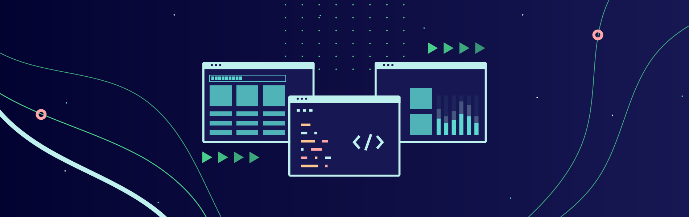
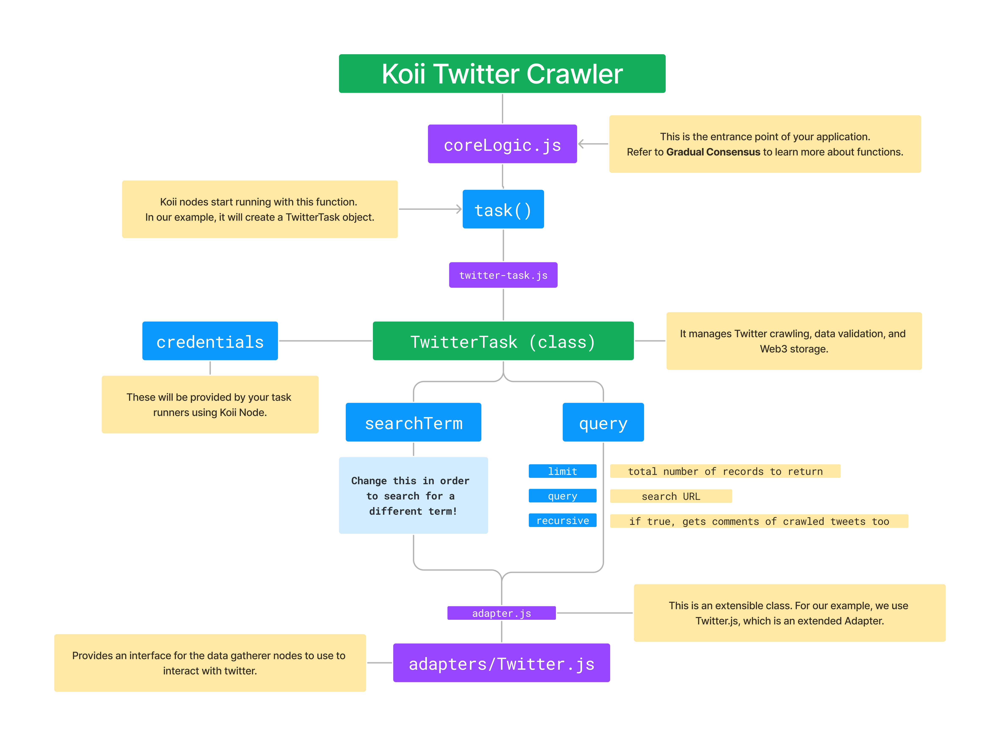

With Koii, you have the power of hundreds of CPUs that belong to real users at your fingertips. By utilizing this power, you can build **crawlers that are more powerful than ever before.**

[The Crawler Template](https://github.com/koii-network/X-scraper) provides a simple crawler that uses headless browsers to gather data from public websites.

** It is designed to be used as a template for building your crawlers, ** exclusively for theoretical use in public archival projects and is not intended to be used for for-profit activities.

:::tip Example usecases:

- Tracking your own social media presence
- Archiving or backing up sensitive content to protect against persecution

:::

:::warning Do not use this template to:

- Steal data (i.e. selling large-scale analytics)
- Infringe on personal privacy (i.e. "stalking")

:::

** Important Note: ** Depending on your legal jurisdiction, running a web crawler might require certain permissions. Please consult with a legal professional before engaging in any form of web-crawling or data-gathering activities.

## The Structure

Here is a quick overview of the structure of the template:

