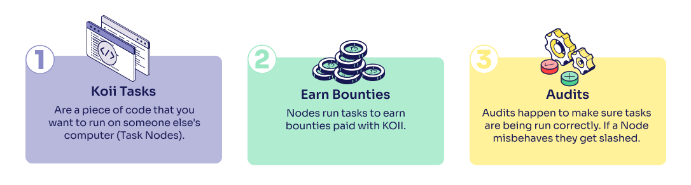

import Description from "@site/src/components/description";
import Tooltip from "@site/src/components/tooltip";

This short tutorial will walk you through deploying your first app on Koii.

We'll cover how to:

1. [Expose a **REST API** use Koii Nodes to host an API](/quickstart/hello-world/get-request)
2. [Coordinate Koii Nodes to submit blockchain transactions](/quickstart/hello-world/task)
3. [Test and debug your distributed application](/quickstart/hello-world/local-test)
4. [Deploy your task to the Koii community cloud](/quickstart/hello-world/deployment)

There's obviously a lot more that Koii can do, so feel free to jump over to the [Template Application](/quickstart/introduction) section for turnkey tutorials on web crawling, database sharding, machine learning, and more.

This tutorial is written mostly in JavaScript, but once you understand the basics, you can use any language that compiles to WebAssembly, or deploy tasks using the ORCA container manager.

:::info
If you are interested in gaining an in-depth understanding of the task development process, we recommend using our [Task Development Guide](/develop/write-a-koii-task/task-development-guide/). This guide provides comprehensive and detailed information on the entire process of developing tasks for the Koii platform. By following the guide, you can explore various aspects, best practices, and guidelines that will assist you in creating robust and effective Koii tasks.
:::


<!-- There are many reasons to build on Koii, but here are  two of the big ones:

1.  **Reduce existing hosting costs and increase uptime**

    Building community-powered apps on Koii can [reduce costs](/concepts/distributed-cloud/reduced-computing-costs) and [increase reliability](/concepts/distributed-cloud/better-data).
    Our market-based, on-demand compute can streamline existing applications and reduce dev-ops headaches. Having a **100% uptime** is now possible with Koii, as whenever one of the nodes goes down, another one will take its place.

2.  **Develop revolutionary applications**

    Our community cloud allows you to create products that would be simply impossible to create with Web2 solutions. As an example, you can create a social network hosted by its users, unstoppable web crawlers and next-generation neural networks trained with hard-to-obtain data, and much more. -->

<!-- add line break below -->

<!-- We accomplish all these by utilizing <Tooltip text="Koii Nodes"/>.
 -->

## What is a Node?

Nodes are people using their computers to create a world-wide network of servers. You can pay them with KOII in order to incentivize them to run your application on their own machines.

In order to host your application, you can use the already existing pool of task runners, or recruit people that would volunteer to help hosting your application You can communicate with them, by using the <Tooltip text="Koii SDK"/>.


## What is a Task?


A task is a piece of code that you want to run on someone else's computer.

To prepare your project as a task, we'll build two main components, a task program and a meta data file.

In pseudocode, a task is a data object like this:

```js
Task : {
    program : String, // A unique locator ID for your task's executable file (i.e. an IPFS CID)
    meta : {
        name : String, // The name of your task - this will be shown to node operators
        description : String, // The description of your task - this will be shown to node operators
        bounty : int, // The amount of KOII that you are willing to pay to run your task
        stake_min : int // The minimum amount of KOII that a node must stake to run your task
    }
}
```

## How do tasks run?

In the next steps of this tutorial, you'll learn how to create a task and run it on the Koii Network. But first, let's take a look at how tasks run on the Koii Network.

When your task runs on Koii nodes, it will have access to three types of data:

- Static metadata ([more](/develop/write-a-koii-task/task-development-kit-tdk/using-the-task-namespace/task-state)): This is the information submitted when the task is created.
- Dynamic state data ([more](/develop/write-a-koii-task/task-development-kit-tdk/using-the-task-namespace/task-state)): This is the live data maintained by the global consensus on <Tooltip text="K2"/>.
- Environment variables ([more](/develop/write-a-koii-task/task-development-kit-tdk/using-the-task-namespace/keys-and-secrets)): Dynamic inputs passed from the user, which can include login info, API keys, and other sensitive data.

```js
Node : {
    meta : {
        id : String, // The ID of your task, running on someone else's computer
        task_name : String, // The name of your task
        task_description : String, // The description of your task
        task_audit_program: String, // The IPFS CID of the task code
        stake_pot_account : String, // The address which will hold bounty rewards and collateral
        stake_min : Number, // The minimum amount of KOII that a node must stake to run your task
    },
    state : {
        // The current confirmed consensus on your task's data
        task_manager : String, // The address of the task's owner,
        is_whitelisted : Boolean, // Whether or not this task is whitelisted to run on nodes
        is_active : Boolean, // Whether or not this task is currently running on nodes
        round : int, // The current round of the task
        bounty : Number, // the current amount of rewards in the task's bounty pool
        nodes : [ Address : String ], // The current list of staked nodes participating in this task
    },
    environment : {
        __any_name__ : String // Any environment variables that you want node operators to pass to your task
    }
}
```

In the next lesson, we'll demonstrate how to get up and running using the <Tooltip text="Koii SDK"/> to create and manage tasks.

<!-- line break -->
